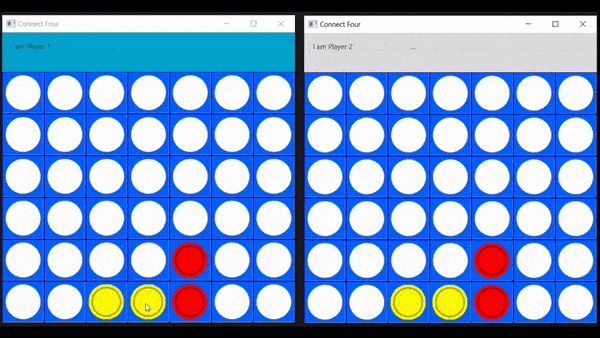

# Connect_Four_Final
Connect 4 Application using JavaFx and Java Socket programming

<b>Demo</b>  

 
 
Instructions:
1. Run Server.java
2. Run 2 Intstances of Main.java - First instance will connect as Player 1, second will connect as Player 2 
3. Play
 
 
Misc. More then one game can be played at a time. The server starts a new game in a new thread for each two clients that connect to it 

